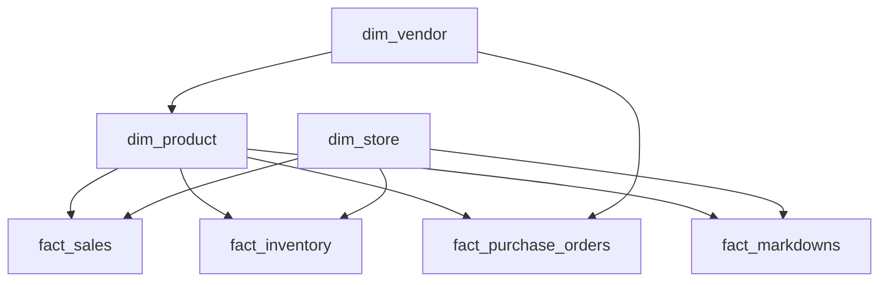

# NORTHSTAR

## Merchandise Planning & Assortment Optimization

**EXCEL - SQL - PYTHON - MERCHANDISING ANALYTICS - INTERACTIVE WEB DASHBOARD**

Northstar Home & Living is a fictional 10-store Canadian home and lifestyle retailer. This repository contains a complete merchandise decision-support system for assortment planning, open-to-buy, initial allocation, replenishment, inventory transfers, markdowns, seasonal planning, and vendor performance.

The project is designed to answer one practical question: **what should the merchandiser buy, where should it be placed, when should it be replenished, and when should it exit?**

## Business problem

Northstar had high-performing products selling out in priority stores while identical merchandise accumulated elsewhere. Management relied on disconnected reports, inconsistent replenishment rules, and reactive markdown decisions. The completed system turns sales, margin, inventory, store, vendor, and seasonal data into specific weekly actions.

## Project scope

| Area | Scale |
| --- | ---: |
| Stores | 10 |
| SKUs | 2,255 |
| Vendors | 20 |
| Sales transaction lines | 120,000 |
| Inventory snapshots | 22,550 |
| Purchase order lines | 6,000 |
| Markdown events | 1,200 |
| SQL analyses | 18 |

All business names and records are synthetic. The dataset is deterministic and reproducible with `python/generate_data.py`.

## Decision system

- **Trading overview:** net sales, plan variance, margin, sell-through, inventory and stock turn.
- **Assortment planning:** category contribution, sales per SKU, price architecture and investment signals.
- **Open-to-buy:** monthly purchasing capacity after inventory targets, markdowns and committed orders.
- **Replenishment:** lead-time demand, safety stock, minimum order quantity and critical stock-out flags.
- **Allocation and transfers:** demand-weighted initial allocation and store-to-store rebalancing.
- **Markdown and seasonal exit:** staged markdown depth, velocity response and next-season commitment.
- **Vendor portfolio:** commercial productivity, delivery reliability, defects, lead time and supplier score.

## Data model



## Core KPIs

| KPI | Definition |
| --- | --- |
| Net Sales | Gross sales less discount |
| Gross Margin % | Gross margin dollars divided by net sales |
| Sell-Through % | Units sold divided by units sold plus ending inventory |
| Weeks of Supply | Ending inventory divided by average weekly units |
| Stock Turn | Annualized cost of goods sold divided by inventory value |
| Markdown Penetration | Discount value divided by original retail value |
| Sales per SKU | Category sales divided by active SKU count |
| Inventory Productivity | Gross margin dollars divided by inventory investment |

## Key findings

1. Lighting generates leading sales per SKU with a comparatively lean inventory share, supporting selective assortment expansion.
2. Premium furniture drives strong sales but carries a disproportionate inventory investment and requires tighter receipt phasing.
3. Eight priority store transfers can place seasonal and decor units into proven demand before margin is sacrificed.
4. Christmas decor finished 18.3% above plan, supporting an approximately 12% increase in next-season commitment.
5. Vendor performance varies materially once on-time delivery, lead time, and defects are considered alongside margin.

## Recommendations

- Increase selective lighting breadth and protect replenishment for high-conversion SKUs.
- Execute transfers before applying markdowns.
- Reduce depth and receipt commitments in slower premium furniture and decor lines.
- Increase next-season Christmas decor investment while reducing winter comfort exposure.
- Concentrate buying with reliable, commercially productive vendors.

## Repository guide

```text
data/             Synthetic CSV tables and generation manifest
excel/            Formula-driven merchandise planning workbook
sql/              Star schema, import guide and 18 business analyses
python/           Deterministic generator and data-quality validation
powerbi/          Power BI theme, DAX measure pack and implementation guide
reports/          Four-page weekly merchandise trading report
documentation/    Data dictionary and project documentation
app/              Interactive six-view portfolio dashboard
public/downloads/ Downloadable project artifacts used by the hosted site
```

## Run locally

Requires Node.js 22.13 or later.

```bash
npm install
npm run dev
```

Validate the production build:

```bash
npm run build
node --test tests/rendered-html.test.mjs
```

Regenerate and validate the synthetic data:

```bash
python python/generate_data.py
python python/clean_data.py
```

## Portfolio story

I acted as the merchandise analyst for a simulated multi-store retailer and built the planning system management uses to make weekly merchandise decisions. The project demonstrates merchandise analysis, assortment planning, open-to-buy, inventory optimization, allocation, replenishment, markdown strategy, vendor performance, SQL, Excel modelling, Python data generation, and business storytelling.
